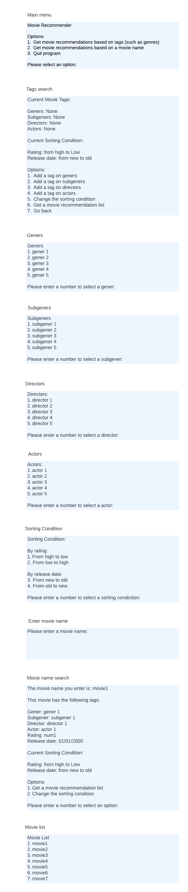
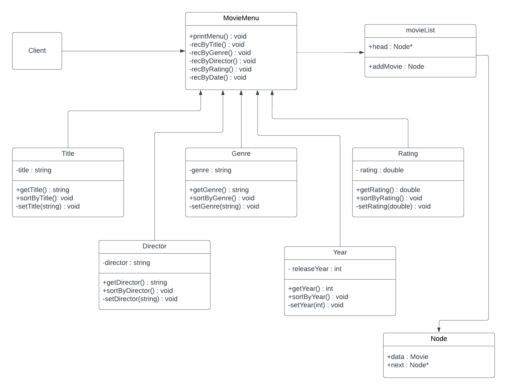

# Movie Recommender
 > Authors: [Jenny Lee](https://github.com/jidud), [Avnish Kovi](https://github.com/Avikovi), [Shelby Wong](https://github.com/ShelbyMitsuko), [Zifeng Lei](https://github.com/Zifeng-Lei)

## Project Description
#### General description
In this program, movies are going to be organized into their respective categories based on genre. Given a movie, the progam will be able to recommend a list of films similar to the movie that was provided.
<!-- > Your project description should summarize the project you are proposing. Be sure to include:
 > * Why is it important or interesting to you? -->
#### Why is it important
This project is important because the topic was interesting and it seemed fun to code a movie recommender. Most people waste time browsing streaming sites trying to find a movie that they may like, however, this program cuts off that time searching by automatically giving them a list of movies, hence saving large amounts of time. In this project, movies will be categorized into their respective genres.

 <!-- > * What languages/tools/technologies do you plan to use? (This list may change over the course of the project) -->
#### Languages/tools/technologies
C++ - This project will be programmed in c++

CMake - This will be used to compile the program

googletest (gtest) - This will be used for unit testing

Git - This will use for performing version control

GitHub - This will use as a web-based Git repository
 <!-- > * What will be the input/output of your project? -->
#### Input/Output
Input - This project will pre input a certain number of movies along with their respective genres, elements, rating, etc. For users, the input for this project can be a specific genre or subgenre of movies, or a combination of multiple tags or criteria. The input can also be the name of a certain movie. This project can also input sorting criteria.

Output - The output of this project is a list of movies, which can be based on the input genre or the combination of labels. The list of movies can also contain movies that are similar in genre, elements, and other aspects to the input movie. The movie list output can be sorted based on the input criteria.

 <!-- > * What are the features that the project provides? -->
#### Project features
 <!-- > This description should be in enough detail that the TA/instructor can determine the complexity of the project and if it is sufficient for the team members to complete in the time allotted. -->
In this project, movies will be sorted and categorized into their respective genres. The program will display movies using under certain genres/subgenres. A user will be able to provide a name of a movie and the application will return a list of movies that are similar to the provided movie.

 > ## Phase II
 <!-- > In addition to completing the "User Interface Specification" and "Class Diagram" sections below, you will need to:
 > * Create an "Epic" (note) for each feature. Place these epics in the `Product Backlog` column
 > * Complete your first *sprint planning* meeting to plan out the next 7 days of work.
 >   * Break down the "Epics" into smaller actionable user stories (i.e. smaller development tasks). Convert them into issues and assign them to team members. Place these in the `TODO` column.
 >   * These cards should represent roughly 7 days worth of development time for your team. Then, once the sprint is over you should be repeating these steps to plan a new sprint, taking you until your second scrum meeting with the reader in phase III.
 > * Schedule two check-ins using Calendly. You need to pick both time slots during your lab on week 6. Your entire team must be present for both check-ins.
 >   * The first check-in needs to be scheduled with your lab TA. During that meeting, you will discuss your project design/class diagram from phase II.
 >   * The second check-in should be scheduled with a reader. During that meeting you will discuss:
 >     * The tasks you are planning for the first sprint
 >     * How work will be divided between the team members -->
## User Interface Specification
 <!-- > Include a navigation diagram for your screens and the layout of each of those screens as desribed below. For all the layouts/diagrams, you can use any tool such as PowerPoint or a drawing program. (Specification requirement is adapted from [this template](https://redirect.cs.umbc.edu/~mgrass2/cmsc345/Template_UI.doc)) -->

### Navigation Diagram

The diagram above gives a basic guideline to our screen layout. From the menu, we would be able to search a movie based on genre, name/title, and/or by actor/director. There will be a filter tab where we would be able to include/exclude and sort out the movies based on sub-genres, name/title, date/year, actor/director, and rating. After all choices are chosen the user would able to "enter" and get a movie recommended by their choice.

### Screen Layouts

This is the layout of each of our screens:

Main menu: The user will first see the main menu. The two design modes we will use for this project are getting movie recommendations by selecting tags or entering a movie name. Users select the mode they want from the main menu.

Tags search: Selecting tags mode will search for associated movies based on the tags selected by the user. This interface displays the user's existing search tags and is classified into genres, sub genres, directors, and actors. The interface also displays the current sorting criteria, including ratings and release dates, and remains the default values if it's not changed by the user. The user can choose to add different types of tags, change the sorting criteria, obtain a movie recommendation list based on existing tags, or return to the previous level.

Genres, Sub-genres, Directors, Actors: These interfaces will display a list of tags of a certain type. The user can choose one to add.

Sorting Condition: This interface will display different sorting criteria. The user can change the existing conditions to one of them.

Enter movie name: The entering a movie name model will search for associated movies based on the tags contained in the movie entered by the user. The user can enter the movie name on this interface.

Movie name search: This interface displays the tags and current sorting criteria of the input movie. The user can choose to generate a movie recommendation list based on these tags and current sorting criteria, or they can choose to change the sorting criteria.

Movie list: This interface displays a list of generated movie recommendations.

## Class Diagram
 

 The diagram above shows the main classes that will be used in the program. As can be seen by the image, the main calling class will be the MovieMenu class which will call the recommender systems by action based on user input in the command prompt line. Following this we will store our database of movies in a CSV file. We will have a Movie class where it will set the movie by its title, genre, director, year, and rating. In MovieList we will be using vectors which will allow us to parse through a list of movies and get the top 5 recommendations based on the chosen sort function. We will also have five derived classes, Title, Genre, Director, Year, and Rating. In these classes we will get each of its input, set it.
 
 SOLID - We used the Single Responsibility Principle(SRP). Originally, in our class diagram, title, genre, director, year, and rating were all in one class, but we changed it so that each action can do its own thing, so they are all made into its own single class. This allowed us to make our code more simpler and it is now easier to keep track of errors.

 Database - We are going to have a .csv file that stores a list of movies with its title, genre, director, year, and rating. This file will be used as a database that gives us our top five outputs. Streams will be used to access the file.
 
 > ## Final deliverable
 > All group members will give a demo to the reader during lab time. ou should schedule your demo on Calendly with the same reader who took your second scrum meeting. The reader will check the demo and the project GitHub repository and ask a few questions to all the team members. 
 > Before the demo, you should do the following:
 > * Complete the sections below (i.e. Screenshots, Installation/Usage, Testing)
 > * Plan one more sprint (that you will not necessarily complete before the end of the quarter). Your In-progress and In-testing columns should be empty (you are not doing more work currently) but your TODO column should have a full sprint plan in it as you have done before. This should include any known bugs (there should be some) or new features you would like to add. These should appear as issues/cards on your Project board.
 > * Make sure your README file and Project board are up-to-date reflecting the current status of your project (e.g. any changes that you have made during the project such as changes to your class diagram). Previous versions should still be visible through your commit history. 
 
 ## Screenshots
 > Screenshots of the input/output after running your application
 ## Installation/Usage
 > Instructions on installing and running your application
 ## Testing
  We practiced test driven design through the utilization of [Google C++ Testing Framework](https://github.com/google/googletest) to create unit tests for our functions. This proved to be a useful development strategy since our project involved the use of many different functions and classes.